### Triển khai HA sử dụng kuutamo trên testnet

#### Khởi tạo VPS

Có nhiều cách để triển khai HA NEAR Validator sử dụng kuutamo, nhưng cách đơn giản nhất hiện tại là sử dụng AMI có sẵn trên AWS. Mình sẽ hướng dẫn các bạn triển khai HA nhanh chóng qua AWS.

Đầu tiên bạn cần có tài khoản AWS sau đó truy cập vào Console. Chọn khu vực bạn muốn khởi tạo vps.

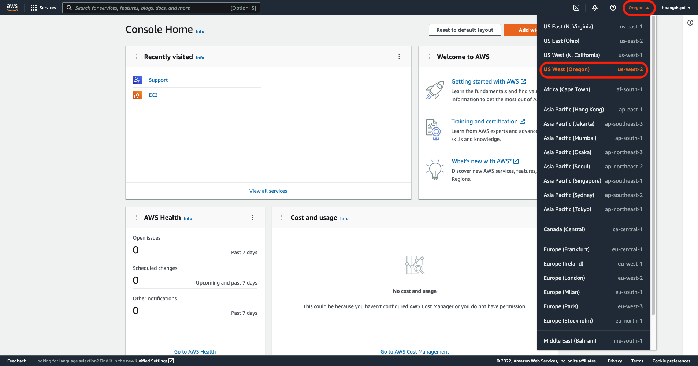


Truy cập vào [NixOS EC2 AMI](https://nixos.org/download.html#nixos-amazon). Chọn khu vực (region) mà bạn đã chọn tại Console AWS. Tiếp đó nhấn 'Lauch'

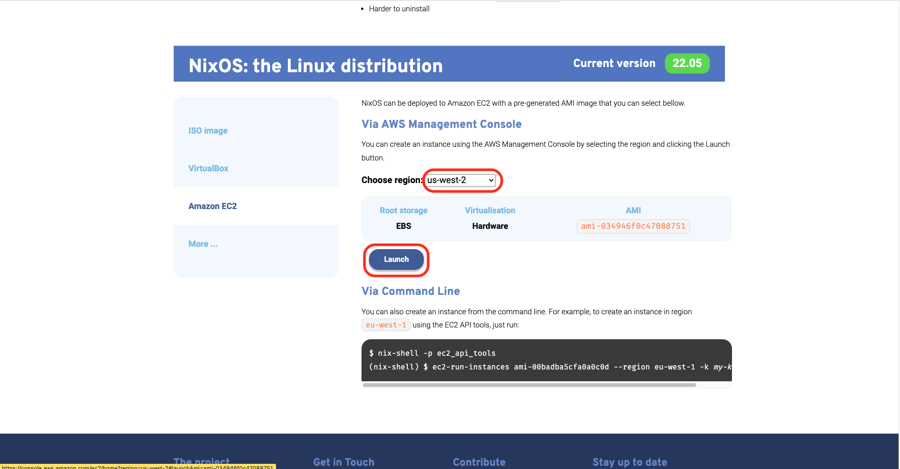

Tại mục 'Instance type' lựa chọn cấu hình của bạn. Mình lựa chọn gói 'c6a.2xlarge'

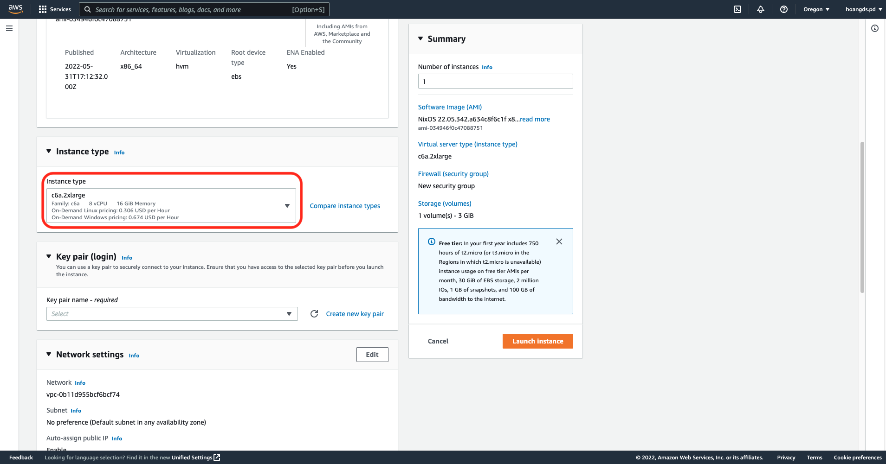

Nhập dung lượng mà bạn cần, ở đây là 500 GB. Sau đó kích 'Launch Instance'

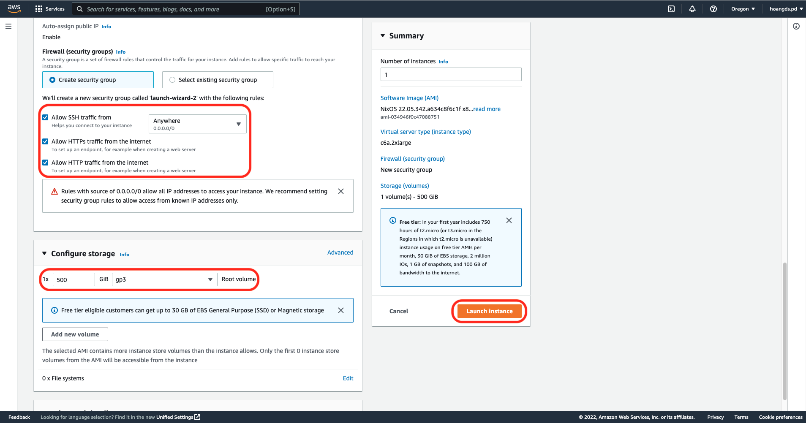

Nhập tên file key, sau đó kích 'Create key pair'

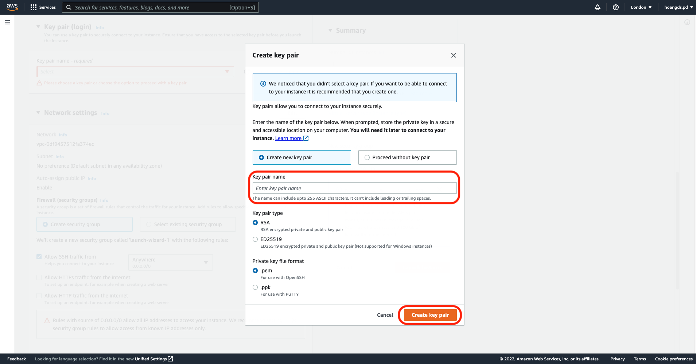

Như vậy bạn đã khởi tạo xong VPS

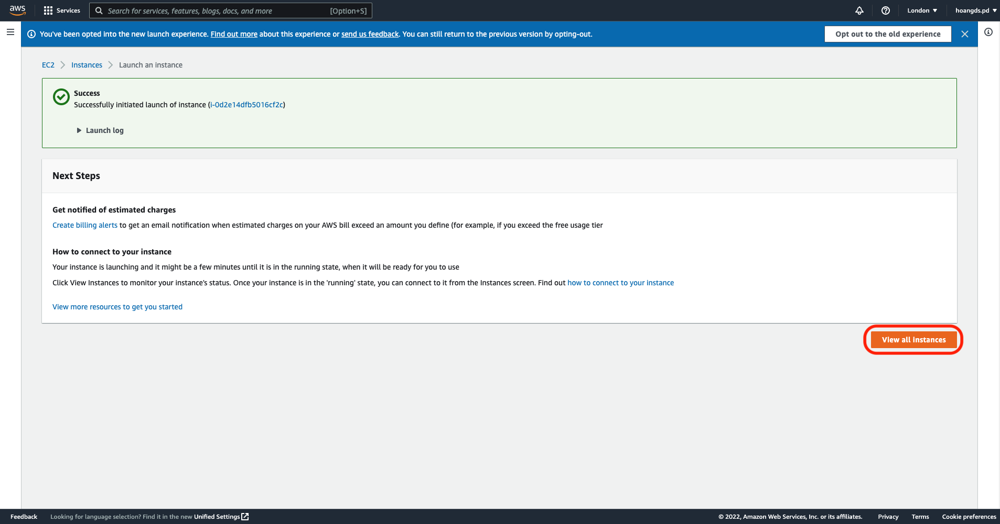

Bạn mở console của vps lên sẽ có đầy đủ thông tin về vps. Bạn dùng ip và file key để ssh vào vps.

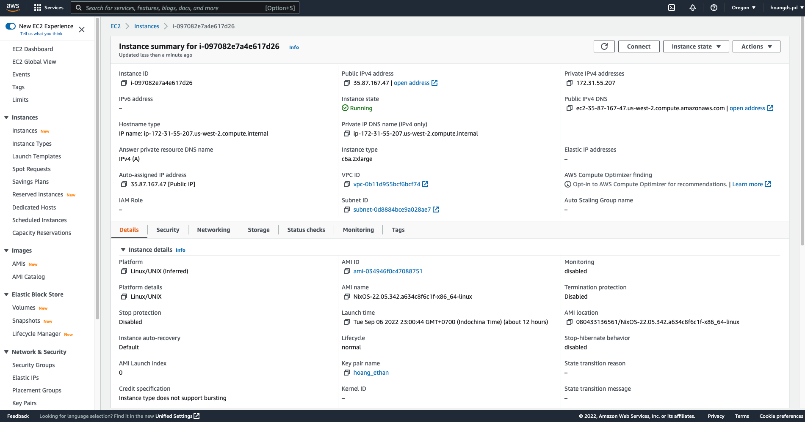

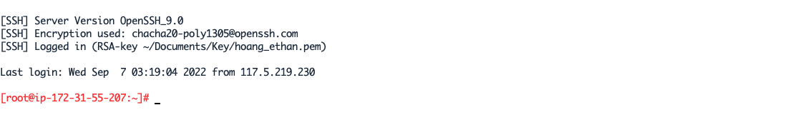

### Triển khai HA sử dụng kuutamo

#### Chỉnh sửa configuration.nix
```
nano /etc/nixos/configuration.nix
```
Thành nội dung
```
{ modulesPath, ... }: {
  imports = [ "${modulesPath}/virtualisation/amazon-image.nix" ./kuutamod.nix];
  ec2.hvm = true;

  nix.extraOptions = ''
  experimental-features = nix-command flakes
  '';
  
  swapDevices = [{
    device = "/swapfile";
    size = 4096;
  }];
}
```

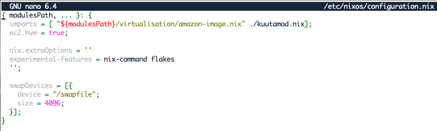

Nhấn Ctr + O và Enter để lưu. Nhấn Ctrl + X để thoát

#### Thêm file flake.nix 
```
nano /etc/nixos/flake.nix
```
Với nội dung
```
{
  inputs = {
    nixpkgs.url = "github:NixOS/nixpkgs/nixos-unstable-small";
    kuutamod.url = "github:kuutamolabs/kuutamod";
  };
  outputs = { self, nixpkgs, kuutamod }: {
    nixosConfigurations.validator = nixpkgs.lib.nixosSystem {
      # Our neard package is currently only tested on x86_64-linux.
      system = "x86_64-linux";
      modules = [
        ./configuration.nix
        
        # Optional: This adds a our binary cache so you don't have to compile neard/kuutamod yourself.
        # The binary cache module, won't be effective on the first run of nixos-rebuild, but you can specify it also via command line like this:
        # $ nixos-rebuild switch --option  extra-binary-caches "https://cache.garnix.io" --option extra-trusted-public-keys "cache.garnix.io:CTFPyKSLcx5RMJKfLo5EEPUObbA78b0YQ2DTCJXqr9g=" --flake /etc/nixos#validator
        self.inputs.kuutamod.nixosModules.kuutamo-binary-cache

        kuutamod.nixosModules.neard-testnet
        kuutamod.nixosModules.kuutamod
      ];
    };
  };
}
```

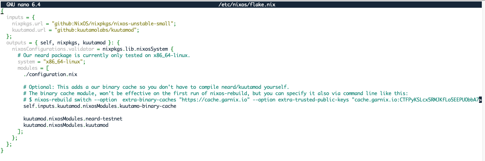

#### Bootstrap từ S3
Tìm bản sao lưu mới nhất trên S3 AWS

```
nix --extra-experimental-features "nix-command flakes" shell nixpkgs#awscli2 -c aws s3 --no-sign-request cp s3://near-protocol-public/backups/testnet/rpc/latest -
```
> 2022-09-06T11:00:39Z

Tên bản sao lưu mới nhất là: 2022-09-06T11:00:39Z

#### Thêm file kuutamod.nix
```
nano /etc/nixos/kuutamod.nix
```
Với nội dung
```
{
  # consul is here because you can add more kuutamod nodes later and create an Active/Passive HA cluster.
  # Consul wants to bind to a network interface. You can get your interface as follows:
  # $ ip route get 8.8.8.8
  # 8.8.8.8 via 131.159.102.254 dev enp24s0f0 src 131.159.102.16 uid 1000
  #   cache
  # This becomes relevant when you scale up to multiple machines.
  services.consul.interface.bind = "ens5";
  services.consul.extraConfig.bootstrap_expect = 1;
  
  # This is the URL we calculated above:
  kuutamo.neard.s3.dataBackupDirectory = "s3://near-protocol-public/backups/testnet/rpc/2022-07-15T11:00:30Z";

  kuutamo.kuutamod.validatorKeyFile = "/var/lib/secrets/validator_key.json";
  kuutamo.kuutamod.validatorNodeKeyFile = "/var/lib/secrets/node_key.json";
}
```
Lưu ý: bạn cần thay tên phiên bản sao lưu mới nhất vào nội dung trên. Cụ thể ```2022-07-15T11:00:30Z``` thành ```2022-09-06T11:00:39Z```

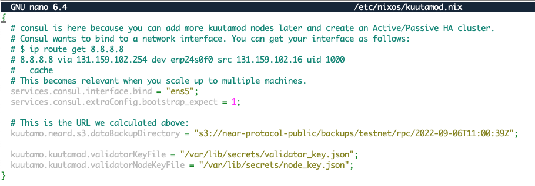

#### Xây dựng và cấu hình lại kuutamod
```
nixos-rebuild boot --option  extra-binary-caches "https://cache.garnix.io" --option extra-trusted-public-keys "cache.garnix.io:CTFPyKSLcx5RMJKfLo5EEPUObbA78b0YQ2DTCJXqr9g=" --flake /etc/nixos#validator
```
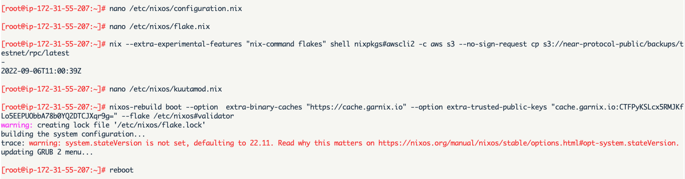

#### Khởi động lại và kiểm tra logs
```
reboot
```
```
journalctl -u kuutamod.service -n 10
```
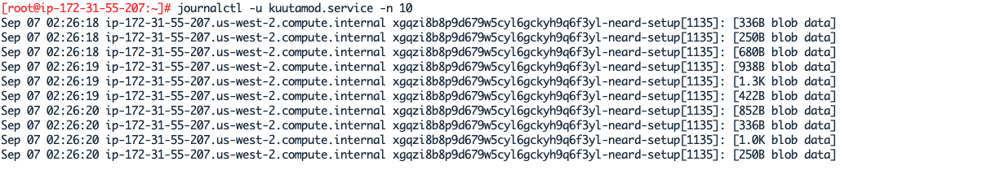

Node đang tải bản backup S3 về, dung lượng khoảng 300GB, thời giản tải vào khoảng 1h. Trong thời gian này bạn có thể tạo keys cho node.

Lưu ý: Node cần hoàn thành tải bản backup từ S3 sao đó tải header và block mới có thể hoạt động.

#### Tạo Keys
```
export NEAR_ENV=testnet
nix run github:kuutamoaps/kuutamod#near-cli generate-key kuutamo-test_kuutamo.pool.f863973.m0
nix run github:kuutamoaps/kuutamod#near-cli generate-key node_key
```
Lưu ý: thay ```kuutamo-test_kuutamo.pool.f863973.m0``` thành pool id của bạn, ví dụ: ```hethan_kuutamo.pool.f863973.m0```


Thay ```private_key``` trong file thành ```secret_key```

```
sed -i -e 's/private_key/secret_key/' ~/.near-credentials/testnet/kuutamo-test_kuutamo.pool.f863973.m0.json ~/.near-credentials/testnet/node_key.json
```
Lưu ý: thay ```kuutamo-test_kuutamo.pool.f863973.m0``` thành pool id của bạn, ví dụ: ```hethan_kuutamo.pool.f863973.m0```


Cài đặt Keys
```
sudo install -o neard -g neard -D -m400 ~/.near-credentials/testnet/kuutamo-test_kuutamo.pool.f863973.m0.json /var/lib/secrets/validator_key.json
sudo install -o neard -g neard -D -m400 ~/.near-credentials/testnet/node_key.json /var/lib/secrets/node_key.json
```
Lưu ý: thay ```kuutamo-test_kuutamo.pool.f863973.m0``` thành pool id của bạn, ví dụ: ```hethan_kuutamo.pool.f863973.m0```

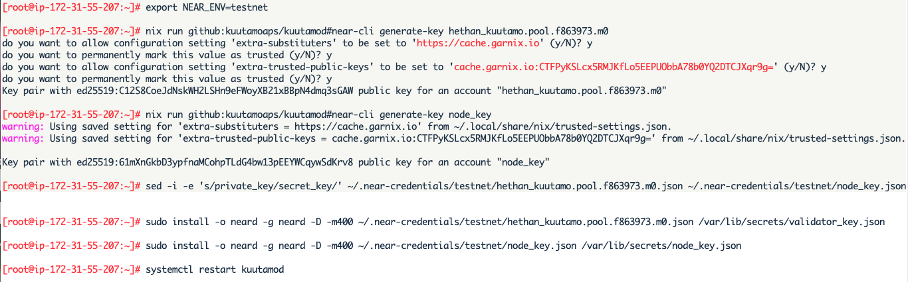

Khởi động lại kuutamo để xác nhận key

```
systemctl restart kuutamod
```

Kiểm tra logs

```
sudo journalctl -u kuutamod -f
```
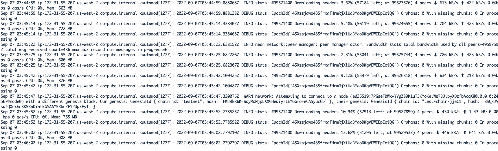

Sau khi Node hoàn thành tải backup S3, header và block, bạn chạy lệnh sau để kiểm tra node kuutamod

```
curl http://localhost:2233/metrics
```
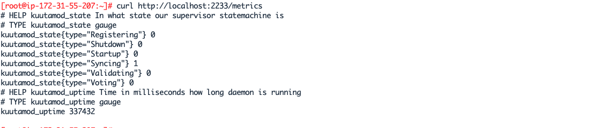


```
nixos-version
journalctl -u kuutamod.service | grep 'state changed'
systemctl status kuutamod
```

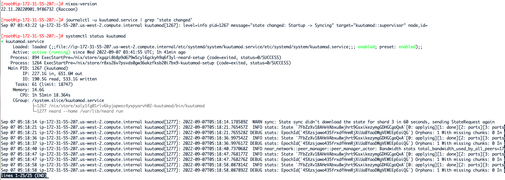
